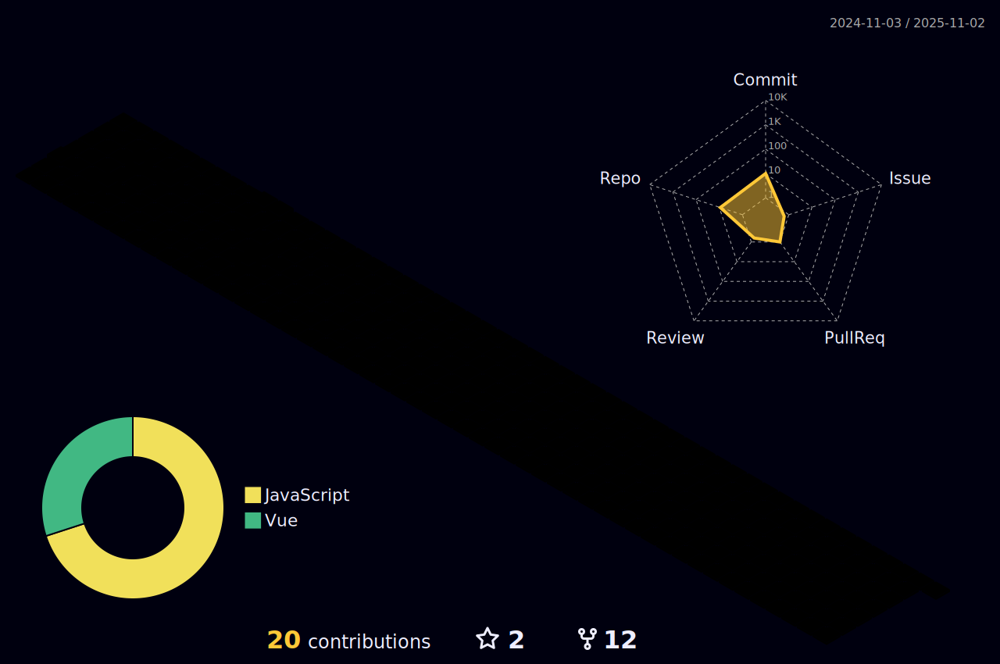

# **Hyungju 2023 ~ 2024**

 
 

## **Hi there👋**
 
 

### **🪃Tech Stack🪃** 

    

    

# 📜 송민호 포트폴리오
### 👉   https://github.com/HyungJu19/portfolio

 
  

### **😆Like😆**

  
  

### **⭐Tech blog⭐**

 
 

### **🔥1day commit🔥**

